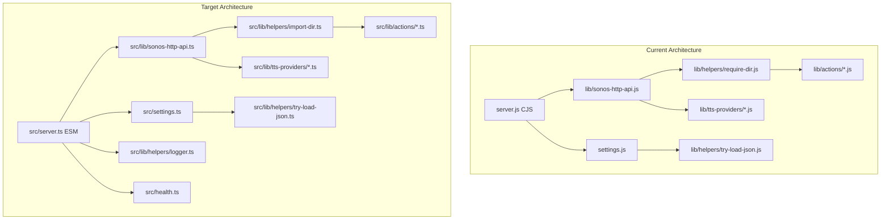

# Design Document: Project Modernization

## Overview

This design covers the modernization of `node-sonos-http-api` from a legacy CommonJS/JavaScript project to a modern ESM/TypeScript codebase with proper infrastructure tooling. The project is a Node.js HTTP API that controls Sonos speakers via REST endpoints.

**Recommended execution order:**
1. **Phase 1: ESM Conversion** — standalone deliverable, unblocks everything else
2. **Phase 3: Dependencies** — some APIs change, easier to fix before adding types
3. **Phase 2: TypeScript** — biggest effort, benefits from clean ESM + updated deps
4. **Phase 4: Infrastructure** — additive (Docker, CI, docs)
5. **Phase 5: Code Quality** — additive (health check, logging, validation, tests)

This ordering minimizes rework: ESM first because TypeScript with `NodeNext` requires ESM imports anyway; dependencies second because updating API signatures before adding type annotations avoids double-work.

## Architecture



The directory structure after full migration:

```
├── src/                    # TypeScript source
│   ├── server.ts
│   ├── settings.ts
│   ├── health.ts
│   └── lib/
│       ├── sonos-http-api.ts
│       ├── helpers/
│       │   ├── import-dir.ts
│       │   ├── try-load-json.ts
│       │   ├── logger.ts
│       │   └── ...
│       ├── actions/
│       ├── tts-providers/
│       └── music_services/
├── types/
│   └── sonos-discovery.d.ts
├── dist/                   # Compiled output (gitignored)
├── test/
├── Dockerfile
├── docker-compose.yml
├── tsconfig.json
├── eslint.config.js
└── package.json
```

## Components and Interfaces

### Phase 1: ESM Conversion

**`import-dir.ts`** — Replaces `require-dir.js` with async dynamic imports:

```typescript
import { readdir, stat } from 'node:fs/promises';
import { join } from 'node:path';

export async function importDir<T>(
  dir: string,
  callback: (module: T) => void
): Promise<void> {
  const files = await readdir(dir);
  for (const name of files) {
    const fullPath = join(dir, name);
    const fileStat = await stat(fullPath);
    if (!fileStat.isDirectory() && !name.startsWith('.') && /\.[jt]s$/.test(name)) {
      const mod = await import(fullPath);
      callback(mod.default ?? mod);
    }
  }
}
```

**`__dirname` replacement pattern:**

```typescript
import { fileURLToPath } from 'node:url';
import { dirname } from 'node:path';

const __filename = fileURLToPath(import.meta.url);
const __dirname = dirname(__filename);
```

**CJS interop for `sonos-discovery`:**

```typescript
import { createRequire } from 'node:module';
const require = createRequire(import.meta.url);
const SonosSystem = require('sonos-discovery');
```

### Phase 2: TypeScript

**Settings interface:**

```typescript
interface Settings {
  port: number;
  ip: string;
  securePort: number;
  cacheDir: string;
  webroot: string;
  presetDir: string;
  announceVolume: number;
  auth?: { username: string; password: string };
  https?: { pfx?: string; passphrase?: string; key?: string; cert?: string };
  aws?: { credentials?: object; name?: string };
  webhook?: string;
  webhookType?: string;
  webhookData?: string;
  webhookHeaderName?: string;
  webhookHeaderContents?: string;
  log?: { level?: LogLevel; format?: 'text' | 'json' };
}

type LogLevel = 'error' | 'warn' | 'info' | 'debug';
```

**Action handler type:**

```typescript
type ActionHandler = (player: Player, values: string[]) => Promise<ActionResponse>;

interface ActionResponse {
  status: string;
  [key: string]: unknown;
}
```

### Phase 3: Dependency Updates

| Package | Current | Target | API Changes |
|---------|---------|--------|-------------|
| `aws-sdk` | 2.x | `@aws-sdk/client-polly` | `new AWS.Polly()` → `new PollyClient()` + `SendCommand` |
| `json5` | 0.5 | 2.x | None — `JSON5.parse()` is the same |
| `html-entities` | 1.x | 2.x | `new XmlEntities().decode()` → `decode()` (named export) |
| `mime` | 1.x | 4.x | `mime.lookup()` → `mime.getType()` |
| `sonos-discovery` | tarball | local workspace | Keep as `createRequire` import until typed |

**AWS Polly v3 migration pattern:**

```typescript
import { PollyClient, SynthesizeSpeechCommand } from '@aws-sdk/client-polly';

const client = new PollyClient({
  region: settings.aws?.region ?? 'us-east-1',
  credentials: settings.aws?.credentials,
});

const command = new SynthesizeSpeechCommand(synthesizeParameters);
const response = await client.send(command);
```

### Phase 4: Infrastructure

**Dockerfile (multi-stage):**

```dockerfile
FROM node:20-alpine AS builder
WORKDIR /app
COPY package*.json tsconfig.json ./
RUN npm ci
COPY src/ src/
COPY types/ types/
RUN npm run build

FROM node:20-alpine
RUN addgroup -S app && adduser -S app -G app
WORKDIR /app
COPY --from=builder /app/dist ./dist
COPY --from=builder /app/node_modules ./node_modules
COPY package.json ./
COPY static/ ./static/
USER app
EXPOSE 5005
CMD ["node", "dist/server.js"]
```

**GitHub Actions workflow steps:**
1. `lint` — ESLint flat config
2. `typecheck` — `tsc --noEmit`
3. `test` — `vitest run`
4. `docker-build` — on tag push only, multi-arch build

### Phase 5: Code Quality

**Health check endpoint:**

```typescript
// GET /health — no auth required
function healthHandler(req: Request, res: Response, discovery: SonosSystem): void {
  const body = {
    status: 'ok',
    timestamp: new Date().toISOString(),
    discovery: discovery.zones?.length > 0 ? 'connected' : 'pending',
  };
  res.writeHead(200, { 'Content-Type': 'application/json' });
  res.end(JSON.stringify(body));
}
```

**Structured logger interface:**

```typescript
interface Logger {
  error(message: string, ...args: unknown[]): void;
  warn(message: string, ...args: unknown[]): void;
  info(message: string, ...args: unknown[]): void;
  debug(message: string, ...args: unknown[]): void;
}

function createLogger(settings: Settings): Logger {
  const levels = ['error', 'warn', 'info', 'debug'] as const;
  const threshold = levels.indexOf(settings.log?.level ?? 'info');
  const format = settings.log?.format ?? 'text';
  // ...
}
```

**Error handling in request handler:**

```typescript
// Before action dispatch
if (!player) {
  return sendResponse(res, 404, { status: 'error', error: `Player "${playerName}" not found` });
}
if (!actions[opt.action]) {
  return sendResponse(res, 400, { status: 'error', error: `Unknown action: "${opt.action}"` });
}
```

## Data Models

### Settings Model

```typescript
// Default settings (unchanged from current behavior)
const DEFAULT_SETTINGS: Settings = {
  port: 5005,
  ip: '0.0.0.0',
  securePort: 5006,
  cacheDir: resolve(__dirname, 'cache'),
  webroot: resolve(__dirname, 'static'),
  presetDir: resolve(__dirname, 'presets'),
  announceVolume: 40,
};
```

### Settings Merge Function

The `merge` function performs a deep merge where source values override target values for leaf properties, and objects are recursively merged:

```typescript
function merge(target: Record<string, unknown>, source: Record<string, unknown>): Record<string, unknown> {
  for (const key of Object.keys(source)) {
    const sourceVal = source[key];
    if (isPlainObject(sourceVal) && isPlainObject(target[key])) {
      merge(target[key] as Record<string, unknown>, sourceVal as Record<string, unknown>);
    } else {
      target[key] = sourceVal;
    }
  }
  return target;
}
```

### TTS Cache Filename Model

The filename generation must remain backward-compatible:

```
polly-{sha1(phrase)}-{voiceId}.mp3
```

This is critical for cache compatibility — existing cached files must continue to be found after migration.

### Log Entry Model

```typescript
interface LogEntry {
  timestamp: string;  // ISO 8601
  level: LogLevel;
  message: string;
  [key: string]: unknown;  // Additional context
}
```

## Correctness Properties

*A property is a characteristic or behavior that should hold true across all valid executions of a system — essentially, a formal statement about what the system should do. Properties serve as the bridge between human-readable specifications and machine-verifiable correctness guarantees.*

### Property 1: TTS Cache Filename Determinism

*For any* phrase string and voice name, the TTS filename generation function SHALL produce the same filename `polly-{sha1(phrase)}-{voice}.mp3`, and this filename SHALL be identical to what the pre-migration code would produce.

**Validates: Requirements 6.5**

### Property 2: Settings Merge Precedence

*For any* two valid settings objects (target and source), merging source into target SHALL produce a result where every leaf value from source appears in the output, and every leaf value from target that has no corresponding key in source is preserved.

**Validates: Requirements 12.3**

### Property 3: Settings Serialization Round-Trip

*For any* valid settings object, serializing it to JSON and parsing it back SHALL produce an equivalent object.

**Validates: Requirements 12.6, 16.1**

### Property 4: Invalid Player Returns 404

*For any* string that does not match a registered player name, a request to `/{invalidPlayer}/play` SHALL return HTTP 404 with a JSON body containing `status: "error"`.

**Validates: Requirements 13.1**

### Property 5: Unknown Action Returns 400

*For any* string that is not a registered action name, a request to `/{validPlayer}/{unknownAction}` SHALL return HTTP 400 with a JSON body containing `status: "error"` and the unrecognized action name.

**Validates: Requirements 13.2**

### Property 6: Log Level Filtering

*For any* configured log level threshold and any log message emitted at a given level, the message SHALL be output if and only if its level is at or above the configured threshold (where error > warn > info > debug).

**Validates: Requirements 15.2**

### Property 7: Log Entry Structure

*For any* log message string and log level, the formatted log entry SHALL contain a valid ISO 8601 timestamp, the level name, and the original message text. When format is `json`, the output SHALL be valid JSON parseable to an object with `timestamp`, `level`, and `message` fields.

**Validates: Requirements 15.3, 15.4**

## Error Handling

| Scenario | HTTP Code | Response Body | Behavior |
|----------|-----------|---------------|----------|
| Invalid player name | 404 | `{ status: "error", error: "Player \"x\" not found" }` | Log warning, respond |
| Unknown action | 400 | `{ status: "error", error: "Unknown action: \"x\"" }` | Log warning, respond |
| Missing action values | 400 | `{ status: "error", error: "..." }` | Log warning, respond |
| Action throws | 500 | `{ status: "error", error: "..." }` | Log error, respond, don't crash |
| Unhandled rejection | — | — | Log error, don't crash (process handler) |
| HTTPS misconfigured | — | — | Log error, exit with code 1 |
| Port in use | — | — | Log error, exit with code 1 |

**Design decisions:**
- Remove `stack` from error responses (security: don't leak internals)
- Keep `process.on('unhandledRejection')` handler to prevent crashes
- Health endpoint always returns 200 (even during discovery) to avoid container restarts

## Testing Strategy

### Test Runner & Libraries

- **vitest** — test runner (already in devDependencies)
- **fast-check** — property-based testing (already in devDependencies)
- Minimum **100 iterations** per property test

### Property-Based Tests

Each correctness property maps to a single `fast-check` property test:

| Property | Test File | Generator Strategy |
|----------|-----------|-------------------|
| 1: TTS Filename | `test/tts-filename.property.test.ts` | `fc.string()` for phrase, `fc.constantFrom(voices)` for voice |
| 2: Settings Merge | `test/settings-merge.property.test.ts` | `fc.dictionary()` with nested objects |
| 3: Settings Round-Trip | `test/settings-roundtrip.property.test.ts` | Custom `settingsArbitrary` matching Settings interface |
| 4: Invalid Player 404 | `test/error-handling.property.test.ts` | `fc.string()` filtered to exclude registered player names |
| 5: Unknown Action 400 | `test/error-handling.property.test.ts` | `fc.string()` filtered to exclude registered action names |
| 6: Log Level Filtering | `test/logger.property.test.ts` | `fc.constantFrom(levels)` × `fc.constantFrom(levels)` × `fc.string()` |
| 7: Log Entry Structure | `test/logger.property.test.ts` | `fc.string()` × `fc.constantFrom(levels)` × `fc.constantFrom(formats)` |

**Tag format:** Each test includes a comment:
```typescript
// Feature: project-modernization, Property 1: TTS Cache Filename Determinism
```

### Unit Tests (Example-Based)

- Settings loader: JSON5 features (comments, trailing commas, unquoted keys)
- TTS provider: cache hit path, cache miss path, credential passing
- Health endpoint: with devices, without devices, with auth configured
- Error handling: action throws Error, action throws string, action rejects

### Integration Tests

- Action registry loads all modules from directory
- Full request cycle: start → discover → request → response
- Backward compatibility: existing endpoint URLs return same structure

### Test Coverage Targets

- Aim for >80% line coverage on new/converted code
- Property tests cover the core logic paths
- Integration tests cover the wiring

### Running Tests

```bash
npm test              # vitest run (all tests)
npm run test:watch    # vitest (watch mode, for development)
npm run test:coverage # vitest run --coverage
```
